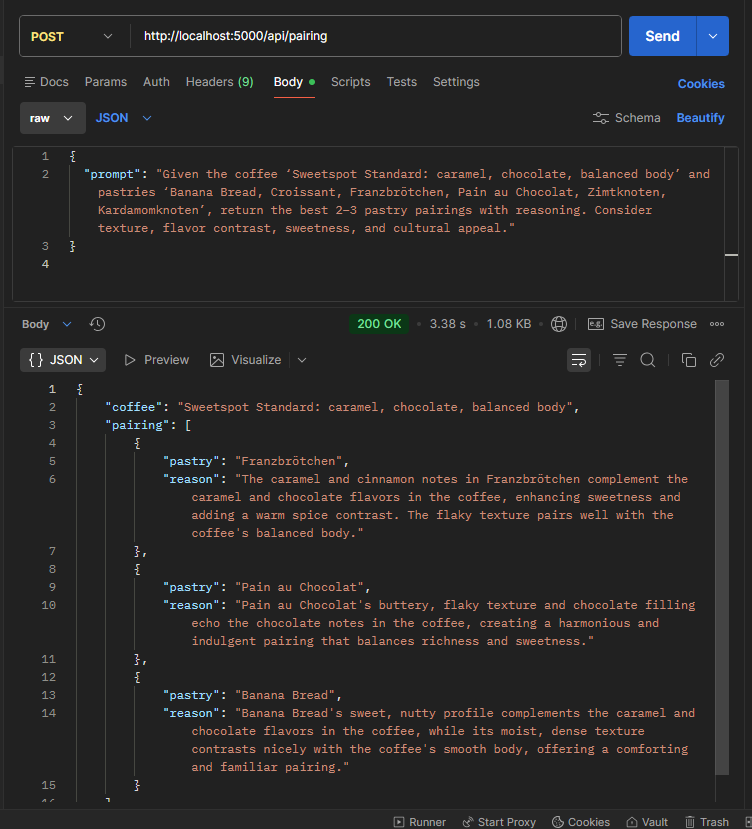

# ☕ Coffee–Pastry AI Pairing API

This is a lightweight AI-powered API that takes a **coffee description prompt** and returns the **best pastry pairings** using our internal dataset.  
The API uses a small model + custom dataset to generate accurate pairings with reasoning.

---

## 📌 How the API Works

1. User sends a text prompt such as:  
   *“Given the coffee Sweetspot Standard (caramel, chocolate, balanced body), return the best 2–3 pastry pairings with reasoning.”*

2. The backend inserts our **coffee + pastry dataset** into the model context.

3. The AI generates JSON output:

```json
{
  "coffee": "Sweetspot Standard (balanced, chocolate, caramel)",
  "pairing": [
    {
      "pastry": "Franzbrötchen",
      "reason": "Caramel sweetness mirrors the roasted chocolate notes of the blend."
    },
    {
      "pastry": "Kardamomknoten",
      "reason": "Warm spice complements creamy milk-based espresso drinks."
    }
  ]
}
```
## End point
POST /api/pairing
Content-Type: application/json


